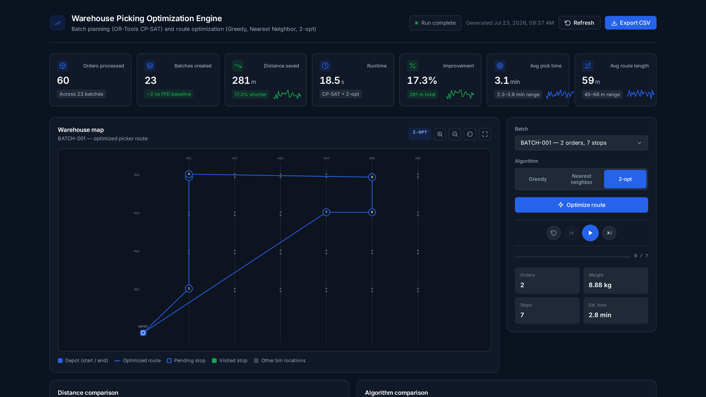

# Warehouse Picking Optimization

Final-year CS capstone project. It takes a set of warehouse orders and decides (1) which orders to pick together in the same tote and (2) what path the picker should walk to collect them. Results go out as CSV/PNG reports and a small static dashboard.

Both decisions are standard problems: multi-dimensional bin packing for the batching and the travelling salesman problem for the route. I compared the solvers against simple baselines to see how much difference they make on the sample data.

The sample data (60 orders, 129 SKUs, 144 bin locations) is synthetic and only there so the code runs out of the box. The numbers below say nothing about a real warehouse.



*Screenshots are from an earlier run, so their numbers differ slightly from the current `frontend/data/`.*

## What it does

- Groups orders into totes with OR-Tools CP-SAT, limited by weight, volume and item count. First-Fit-Decreasing (FFD) is the baseline.
- Plans a route for each batch with greedy, nearest neighbour and 2-opt. Distances are Manhattan distances on the bin grid.
- Validates the three input CSVs and skips or warns on bad rows (negative weights, duplicate IDs, unknown SKUs or locations) instead of crashing.
- Writes CSV reports and Matplotlib plots (`output/`).
- Exports the results to a static dashboard in `frontend/`.

## Layout

```
api.py      FastAPI app (GET /, GET /health, POST /optimize)
data/       sample CSVs (orders, inventory, warehouse layout)
src/        pipeline: loading, batching, routing, reports, dashboard export,
            api_service.py (thin wrapper the API calls; no optimization logic)
tests/      pytest suite
frontend/   static dashboard + privacy/terms/cookie pages (no build step)
output/     generated reports and plots
```

## Method

**Batching.** Each tote holds at most 9 kg, 0.45 m³ and 24 units. FFD sorts orders by weight and puts each into the first tote it fits. CP-SAT models the same problem with one boolean per order/tote pair and minimises the number of totes. It runs with a 20 s limit, so it may return a feasible packing that is not proven optimal (the log says which). On the sample data it used 1-2 fewer totes than FFD in the runs I recorded; other data may differ.

**Routing.** Greedy visits stops in input order (the "no routing" baseline). Nearest neighbour always walks to the closest unvisited stop. 2-opt starts from the nearest-neighbour route and reverses segments while that shortens the route, up to 400 passes. All three are heuristics and none guarantees the shortest route.

**Sample result.** In the recorded runs, CP-SAT + 2-opt gave roughly 16-17% less total distance than FFD + greedy. That is specific to this sample data.

**Time estimates** assume 1.2 m/s walking speed and 18 s per stop (`src/utils.py`). They are assumptions, not measurements.

## Setup

Python 3.10+ (developed on 3.12).

```bash
python3 -m venv venv
source venv/bin/activate      # Windows: venv\Scripts\activate
pip install -r requirements.txt
```

## Usage

```bash
cd src
python main.py                                   # full pipeline
python main.py --data-dir ../data --output-dir ../output
python main.py --max-route-plots 10
python main.py --verbose
python export_dashboard_data.py                  # regenerate the dashboard data
```

Open `frontend/index.html` in a browser to view the dashboard. It only replays results the Python code already computed; nothing is optimised in the browser. With the API below enabled, the results come from the backend instead, but the browser still only displays them.

To use your own data, replace the CSVs in `data/` and keep the column headers (see `src/csv_loader.py`). The `customer` column in `orders.csv` is optional and unused, so you can leave personal names out.

## API (FastAPI backend)

`api.py` exposes the existing pipeline over HTTP. It reuses `src/` as-is (through `src/api_service.py`); no algorithm was rewritten.

| Endpoint | Purpose |
|---|---|
| `GET /` | service status and endpoint list |
| `GET /health` | health check (`{"status": "ok"}`) |
| `POST /optimize` | runs batching + routing on the bundled sample data. Optional body: `{"algorithm": "greedy" \| "nearest_neighbor" \| "2-opt"}` (default `2-opt`). Returns the same `meta` / `warehouse` / `batches` structure the dashboard renders, plus `metrics` and `algorithm_comparison`. |

Interactive docs are at `/docs`. An unknown algorithm returns 422; engine data errors return 500.

Run locally:

```bash
pip install -r requirements.txt
uvicorn api:app --reload --port 8000
curl -X POST localhost:8000/optimize -H "Content-Type: application/json" -d '{"algorithm": "2-opt"}'
```

CORS allows any origin by default. To restrict it, set `ALLOWED_ORIGINS` on the backend to a comma-separated list of dashboard URLs.

**Frontend.** The only setting is `API_BASE_URL` in `frontend/config.js`. Leave it empty and the dashboard uses the precomputed `data/dashboard_data.js`, exactly as before. Set it (for example `http://localhost:8000`) and the dashboard calls `POST /optimize` on load. If the API is unreachable, times out (`API_TIMEOUT_MS`, default 15 s) or returns an unexpected shape, it falls back to the precomputed data and says so in the status line. If you use a custom backend domain, add it to `connect-src` in the CSP meta tag in `frontend/index.html`.

**Deploying on Render.** Create two services from this repo:

1. *Web Service* (backend): build command `pip install -r requirements.txt`, start command `uvicorn api:app --host 0.0.0.0 --port $PORT`, Python 3.12 (`.python-version`). Optionally set `ALLOWED_ORIGINS`.
2. *Static Site* (frontend): publish directory `frontend`, no build command. Put the backend's URL in `frontend/config.js` as `API_BASE_URL`.

On Render's free tier the backend sleeps when idle and can take 30-60 s to wake, longer than the frontend timeout, so the first load may show the precomputed data. Each `/optimize` call re-runs CP-SAT (up to its 20 s limit per solve), so it is not instant either.

## Tests

```bash
pip install -r requirements-dev.txt
pytest
```

## Privacy and legal pages

The dashboard is static: no forms, accounts or payments, no cookies or browser storage, no analytics, nothing loaded from third-party servers (system fonts only, enforced by a Content-Security-Policy meta tag). `frontend/privacy.html`, `terms.html` and `cookies.html` are drafts with highlighted placeholders (operator, contact/grievance details, hosting, governing law) that need filling in and a legal review before a public launch. They make no claim of compliance with any law.

The sample `orders.csv` uses pseudonymous IDs (`CUST-001`, ...). Don't commit real customer details.

## Known gaps

- An order can't be split across totes.
- No picker assignment, zones or aisle congestion.
- Static run only; no dynamic re-batching.
- The dashboard button replays routes it already has (stored or from the API) rather than solving anything in the browser.
- `/optimize` only runs on the bundled sample data; it doesn't accept uploaded orders.
- Icon paths in the dashboard SVG come from an undocumented source; check their licence before publishing.

## License

There is no `LICENSE` file yet. Add one with the correct copyright holder before publishing.
